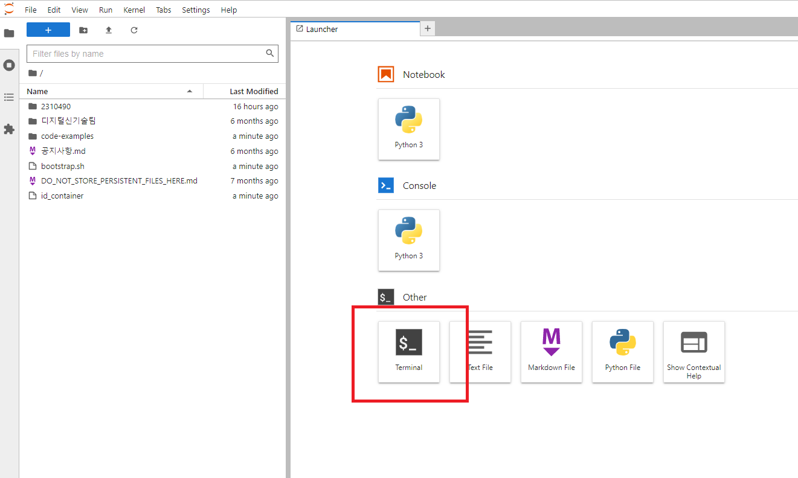

# 한국은행 데이터 분석 라이브러리(bok-da)

> 한국은행 데이터분석 라이브러리(bok-da) 리포지토리

- `bok-da` 라이브러리는 파이썬 기반 데이터 분석 라이브러리로 당행 데이터 분석 업무의 효율성 제고를 위해 개발
  - 기본적인 데이터 입수 및 시각화, 계량경제 분석 도구를 우선 개발
  - 향후 각 부서에서 생산한 분석 코드를 표준화$\cdot$최적화하여 수록함으로써 당행 지적자산으로 축적
  - 부서간 협업$\cdot$학술연구용역등을 통해 개발된 고급 모형(LBVAR, 중립금리 추정모형)을 수록하여 분석 도구 다각화 예정
  
- 라이브러리를 활용하여 데이터 분석의 단계별 작업(데이터 입수$\cdot$전치리, 분석, 시각화, 공유 등)을 단일 인터페이스(`BIDAS 고성능 데이터 분석환경`)에서 수행할 수 있음
   - 파이썬 환경에 익숙하지 않은 사용자를 위해 사용 매뉴얼 제공
   - 직원 누구나 사용 목적에 맞게 소스코드를 수정하거나 새로운 기능을 추가하여 개발에 참여할 수 있음


## 주요 사항

- Scikit-learn과 유사한 방식으로 모형 객체 생성 후, `.fit()` 메서드를 통해 모델 적합을 수행하는 방식으로 구현
- 일부 모델(상태공간모형, UCSV)에서 경우 cython을 통한 빠른 코드 실행을 지원
- `manual` 디렉토리에 모델별 사용 방*법을 담은 매뉴얼을 마크다운 형태로 정리
- `examples` 디렉토리에 주피터 노트북 기반의 예제 코드와 데이터를 포함
- Python `3.9`, `3.10`, `3.11`, `3.12` 기반의 환경을 지원


## 라이브러리 구조(디렉토리 구성)
- `src/bok_da/`: 라이브러리 소스코드 디렉토리
    - `bayes/`: 베이지안 모형 코드 디렉토리
    - `cs/`: 횡단면 데이터 기반 계량모형 디렉토리
    - `data/`: 데이터 입수 및 전처리 관련 코드 디렉토리
    - `linear/`: 선형 모형 코드 디렉토리
    - `panel/`: 패널 모형 코드 디렉토리
    - `patch/`: statsmodels 패키지의 패치를 위한 코드 디렉토리
    - `project/`: 행내 개발 모형 및 분석도구 코드 디렉토리
    - `stata/`: 파이썬 환경에서 stata 활용을 위한 코드 디렉토리
    - `ts/`: 시계열 모형 코드 디렉토리
    - `utils/`: 공용 함수 및 기타 데이터 분석 코드 디렉토리
    - `validation/`: 모형 검증 코드 디렉토리
    - `viz/`: 시각화 도구 코드 디렉토리
    - `__init__.py`: 파이썬 패키지 init 스크립트

- `examples/`: 예제 코드와 데이터를 모아놓은 디렉토리
    - `data/`: 예제 코드 실행에 필요한 데이터 디렉토리
    - `notebooks/`: 모형 및 분석도구별 예제 코드(.ipynb) 디렉토리

- `manual/`: 라이브러리가 지원하는 모형에 대한 자세한 설명이 기재된 문서 디렉토리(지속 업데이트 예정)

- `docs/`: bok-da 설치 매뉴얼(마크다운 및 pdf), 개발 가이드 매뉴얼

- `README.md`: bok-da 리파지토리의 readme 문서

- `Dev Guide.md`: 라이브러리 도구 개발 가이드 문서

- `pyproject.toml`, `setup.py`, `MANIFEXT.in`: bok-da 패키지 빌드를 위한 파일  

<br>

# BIDAS 환경에서 bok-da 라이브러리 설치 및 사용

> bok-da 라이브러리를 BIDAS 환경에서 설치하고 사용하는 방법에는 I. `배포판` 설치와 II. `gitlab repository`를 `clone`해 `수정가능모드`로 설치하는 방법 두가지가 있습니다. 기능 확장을 위해 소스코드 수정이 필요한 경우에는 수정가능모드로 설치하는 것을 권장합니다.

## I. 배포판 설치

### 1. BIDAS Modelhub -> 고성능 데이터 분석환경 -> Jupyterlab(Python) 클릭


### 2. Jupyterlab에서 File -> New Launcher -> Terminal 실행



### 3. bok-da 설치 및 예제코드, 매뉴얼 불러오기
**(bok-da 설치)** Terminal에서 아래 명령어 실행
```bash
pip install bok-da
```
**(예제코드 및 매뉴얼 불러오기)** Terminal에서 아래 명령어 실행
```bash
bokda-import-example_manual
```
`examples/notebooks`폴더의 예제코드와 `manual`폴더의 모형 매뉴얼을 참고해서 라이브러리 활용

## II. Gitlab repository를 clone해 수정가능모드로 설치

### 1. GitLab repository를 내 작업 디렉토리에 복제
Jupyterlab terminal에서 아래 명령어 순서대로 실행
```bash
cd 행번 (예시: cd 2310490)
git config --global http.sslVerify false
git clone https://bidas-gitlab.boknet.intra/digitaltech/bok_library.git
```
[//]: #

## 2. 수정가능모드 설치
Jupyterlab terminal에서 아래 명령어 순서대로 실행
```bash
cd bok_library
pip install -e .
```
`examples/notebooks`폴더의 예제코드와 `manual`폴더의 모형 매뉴얼을 참고해서 라이브러리 활용

[//]: #

<br>

# 개인PC(로컬) 환경에서 bok-da 라이브러리 설치(외부망)

> 외부망 개인 PC 환경(Anaconda 배포판 파이썬을 사용하는 JupyterLab 환경)에서 bok-da 라이브러리를 설치하는 방법을 설명하는 매뉴얼입니다.

---

## I. 개발 환경 준비

Anaconda 배포판 파이썬 환경(Python 버전 3.9 이상) 준비

1. Anaconda 배포판 다운로드 사이트에서 운영체제에 맞는 설치 파일 다운로드  
   - https://www.anaconda.com/download  

2. 설치가 완료되면, **Anaconda Prompt** 실행  

3. Anaconda Prompt에서 가상환경 생성  
   ```bash
   conda create -n <환경이름> python=<버전>
   ```
   예시:
   ```bash
   conda create -n bok-da-env python=3.12
   ```
4. Anaconda Prompt에서 가상환경 활성화  
   ```bash
   conda activate <환경이름>
   ```
   예시:
   ```bash
   conda activate bok-da-env
   ```

## II. JupyterLab 실행

1. Anaconda Prompt에서 **jupyter lab** 설치
   ```bash
   pip install jupyterlab
   ```
1. Anaconda Prompt에서 jupyter lab 실행
    ```bash
    jupyter lab
    ```
    웹브라우저가 자동으로 열리며, jupyter lab 인터페이스가 실행됨

## III. bok-da 라이브러리 설치

1. 새로운 작업 디렉토리(`bok_library`) 생성  
   예시: `C:/Users/BOK/Desktop/bok_library`

2. `python-wheels-windows.zip`파일을 `bok_library` 폴더로 이동 후 압축해제

3. jupyter lab 터미널 실행 후 작업 디렉토리 경로 지정  
   - jupyter lab의 `Launcher` 탭에서 `Terminal` 클릭
   - (터미널에서) `cd Desktop/bok_library`

4. jupyter lab 터미널에서 가상환경의 파이썬 버전에 맞는 bok-da 휠파일 설치  
   예시: 파이썬 버전이 3.12인 경우,
   ```bash
   pip install bok_da-0.3.1-cp312-cp312-win_amd64.whl
   ```

<br>

# 개인PC(로컬) 환경에서 bok-da 라이브러리 설치(내부망)

> 내부망 개인 PC 환경(Anaconda 배포판 파이썬을 사용하는 JupyterLab 환경)에서 bok-da 라이브러리를 설치하는 방법을 설명하는 매뉴얼입니다.

---

## I. 개발 환경 준비

Anaconda 배포판 파이썬 환경(Python 버전 3.9 이상) 준비

1. `S:드라이브` - `info` - `전직원용` - `데이터분석서비스` - `설치파일` - `Python3.11` 폴더로 이동

2. Python3.11 폴더 내 `# Python 설치 안내.txt`에 따라 파이썬 설치 

## II. JupyterLab 실행

1. Python3.11 폴더 내 `Jupyter Lab(BOK)` 아이콘 더블클릭하여 jupyter lab 실행

2. 웹브라우저가 자동으로 열리며, jupyter lab 인터페이스가 실행됨

## III. bok-da 라이브러리 설치

1. 새로운 작업 디렉토리(`bok_library`) 생성  
   예시: `D:/python_projects/bok_library`

2. `python-wheels-windows.zip`파일을 `bok_library` 폴더로 이동 후 압축해제

3. jupyter lab 터미널 실행 후 작업 디렉토리 경로 지정  

4. jupyter lab 터미널에서 bok-da 휠파일 설치  
   ```bash
   pip install bok_da-0.3.1-cp311-cp311-win_amd64.whl
   ```

<br>

# bok-da 라이브러리 사용

1. jupyter lab에서 새 Python 노트북 파일(.ipynb 확장자) 열기

2. 노트북 셀에서 아래와 같이 코드 입력하여 bok-da 라이브러리 불러오기
    ```python
    import bok_da as bd
    ```

<br>

# 활용 예제코드 및 매뉴얼 불러오기

jupyter lab 터미널에서 아래 명령어를 실행하면, 예제코드, 데이터, 매뉴얼 폴더가 생성됨
```bash
bokda-copy-examples_manual
```

`examples/notebooks` 폴더에서 예제코드를 확인하고 테스트할 수 있음  
`examples/data` 폴더에 예제코드에서 사용하는 데이터가 수록되어 있음  
`manual` 폴더에 모형 사용 및 하이퍼파라미터 옵션에 대한 설명이 있음

<br>

# 라이브러리 개발 기여
- 디지털혁신실 데이터사이언스팀
- 고려대학교 경제학과 한치록, 강규호 교수 연구진
- 서강대학교 경제학과 허준영, 김재호 교수 연구진
- 연세대학교 응용통계학부 진익훈 교수 연구진

<br>

# 라이브러리 관련 문의
디지털혁신실 데이터사이언스팀 이창훈 과장(4638)